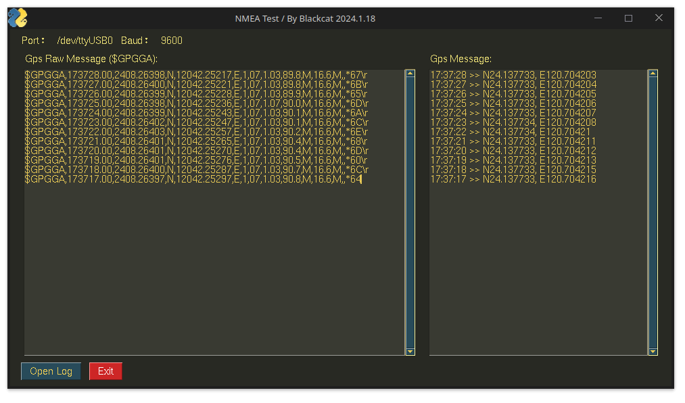

# NAME Protocol Test
Test NAME Message Decode Result GUI Tools With pynmea2 package with log.


## Support Module
- [x] NEO-7M

# Require
- Python 3.8 or Later
- [Pyserial](https://pypi.org/project/pyserial/)
- [Pynmea2](https://pypi.org/project/pynmea2/)
- [PySimpleGui](https://pypi.org/project/PySimpleGUI/)

# Run 
```
python ./appmain.py
```

## Config File
```ini
[DEFAULT]
PORT=/dev/ttyUSB0   # Port Name, In Windows Change To COMXX.
BAUD=9600           # baudrate, default is 9600 bps
```